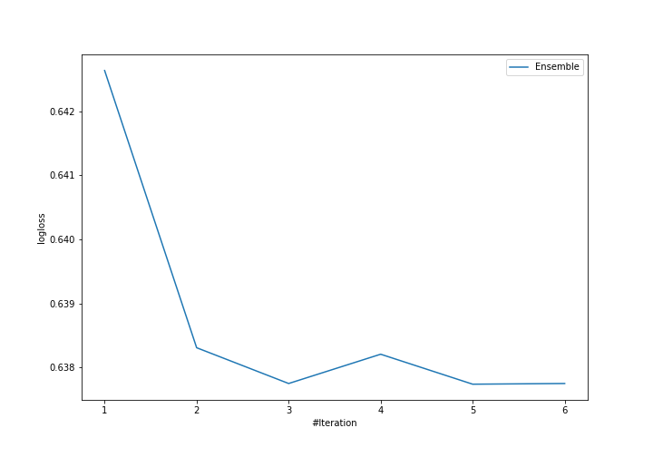
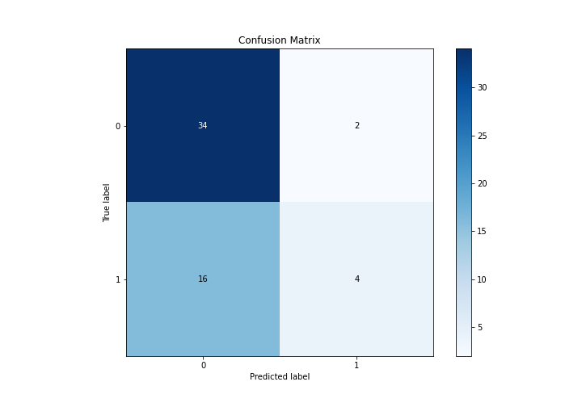
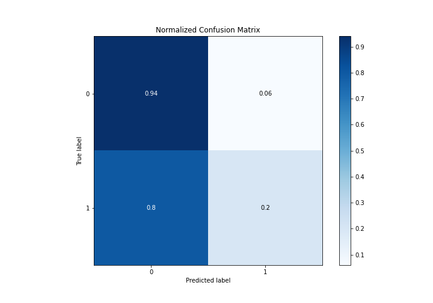
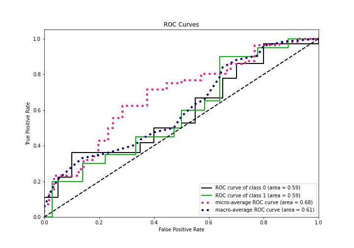
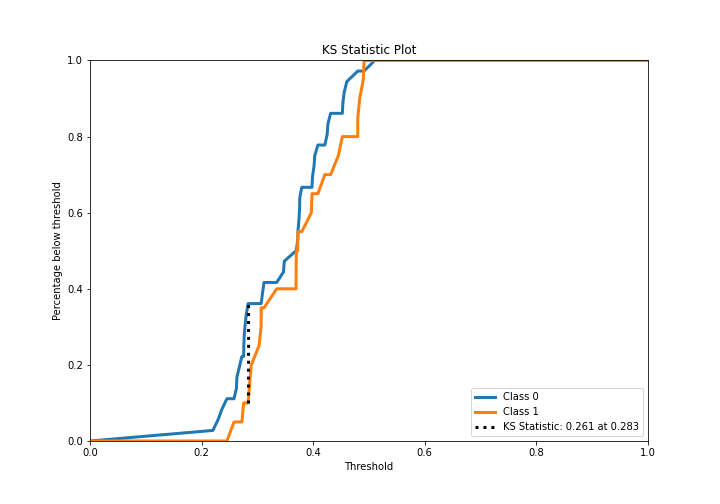
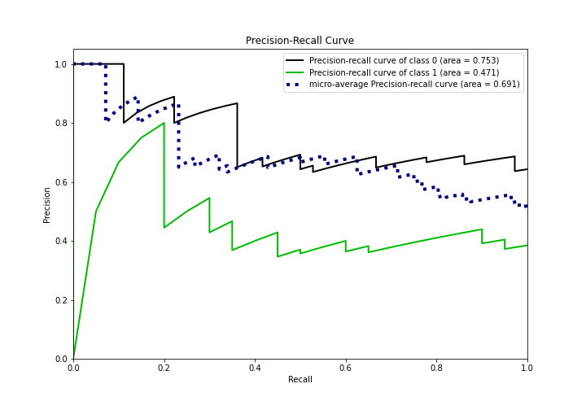
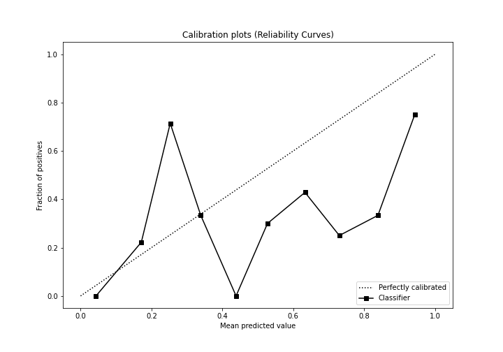
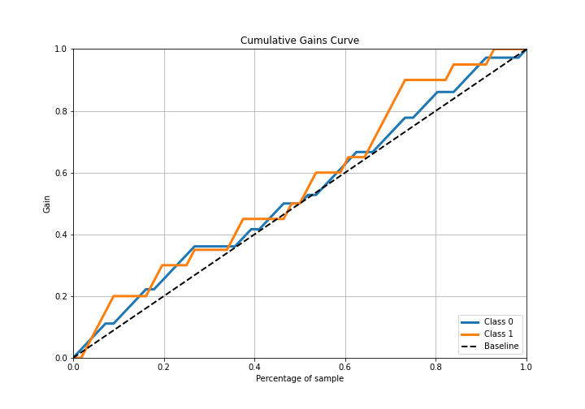
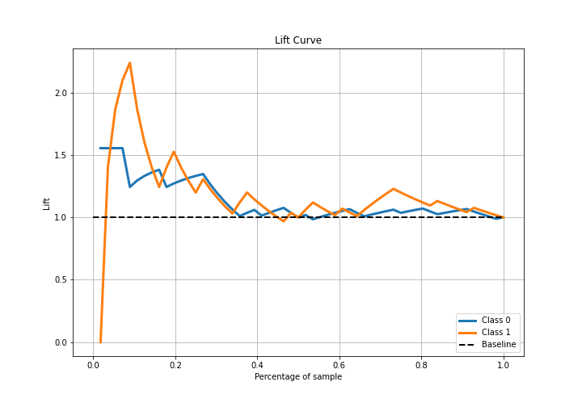

# Summary of Ensemble

[<< Go back](../README.md)

## Ensemble structure
| Model                  |   Weight |
|:-----------------------|---------:|
| 1_Baseline             |        2 |
| 6_Default_RandomForest |        3 |

## Metric details
|           |    score |   threshold |
|:----------|---------:|------------:|
| logloss   | 0.637739 |  nan        |
| auc       | 0.590278 |  nan        |
| f1        | 0.590164 |    0.284983 |
| accuracy  | 0.678571 |    0.475037 |
| precision | 0.666667 |    0.475037 |
| recall    | 1        |    0.198183 |
| mcc       | 0.282523 |    0.284983 |

## Metric details with threshold from accuracy metric
|           |    score |   threshold |
|:----------|---------:|------------:|
| logloss   | 0.637739 |  nan        |
| auc       | 0.590278 |  nan        |
| f1        | 0.307692 |    0.475037 |
| accuracy  | 0.678571 |    0.475037 |
| precision | 0.666667 |    0.475037 |
| recall    | 0.2      |    0.475037 |
| mcc       | 0.223772 |    0.475037 |

## Confusion matrix (at threshold=0.475037)
|              |   Predicted as 0 |   Predicted as 1 |
|:-------------|-----------------:|-----------------:|
| Labeled as 0 |               34 |                2 |
| Labeled as 1 |               16 |                4 |

## Learning curves

## Confusion Matrix

## Normalized Confusion Matrix

## ROC Curve

## Kolmogorov-Smirnov Statistic

## Precision-Recall Curve

## Calibration Curve

## Cumulative Gains Curve

## Lift Curve

[<< Go back](../README.md)
