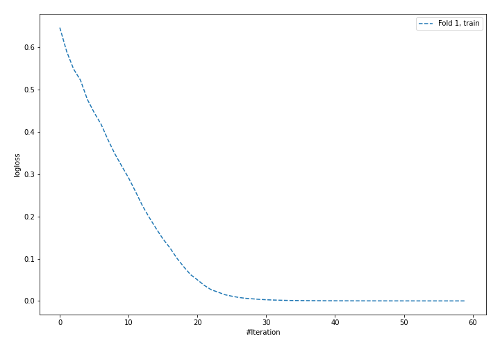
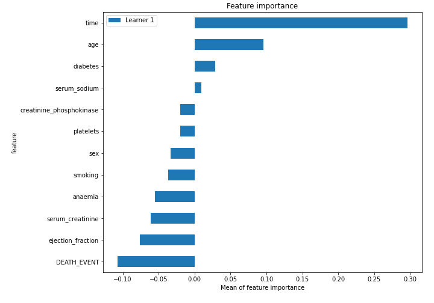
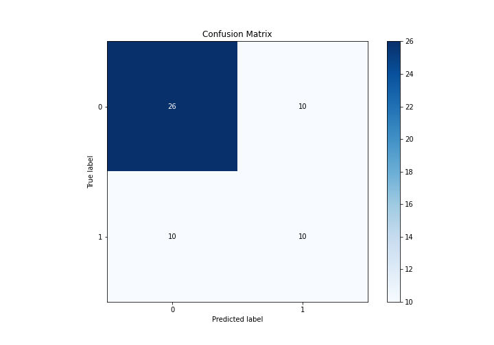
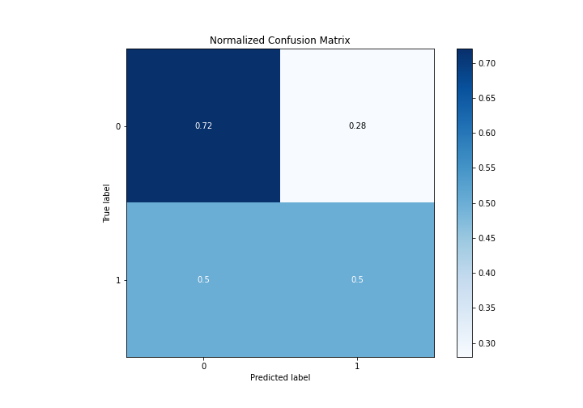
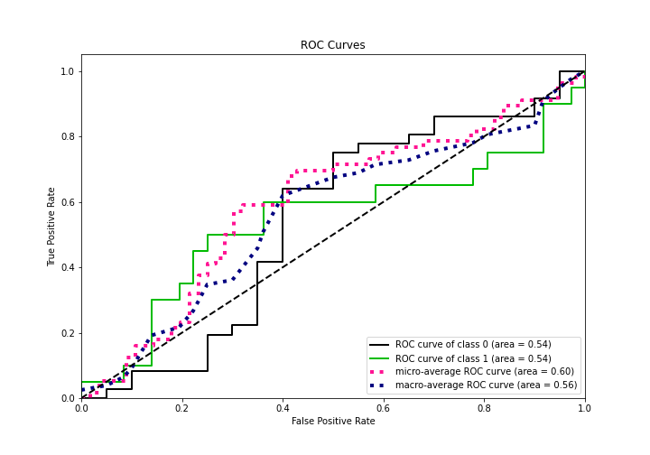
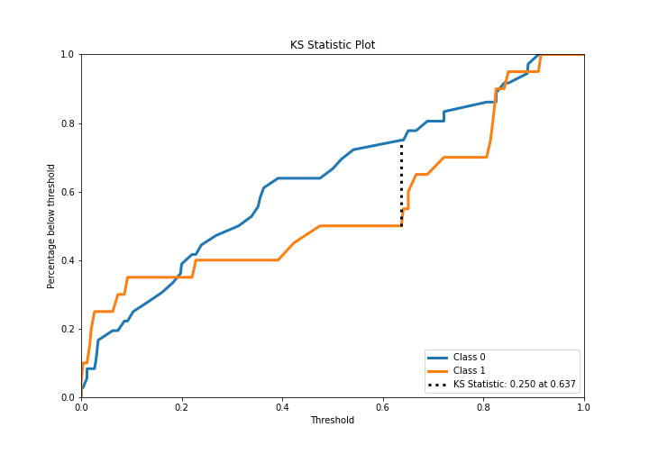
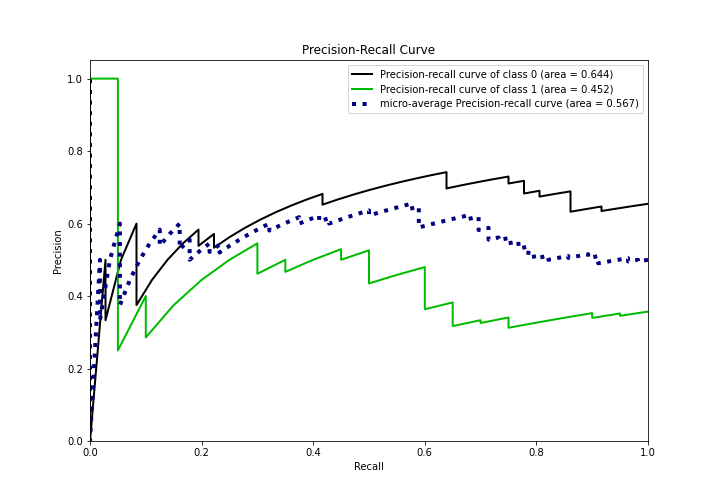
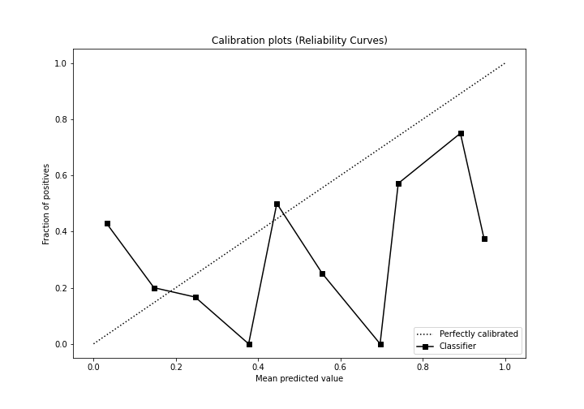
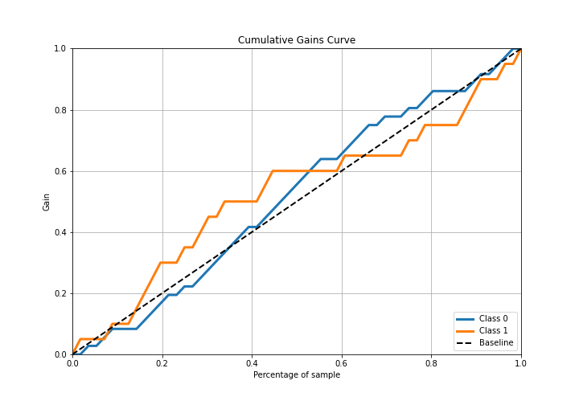
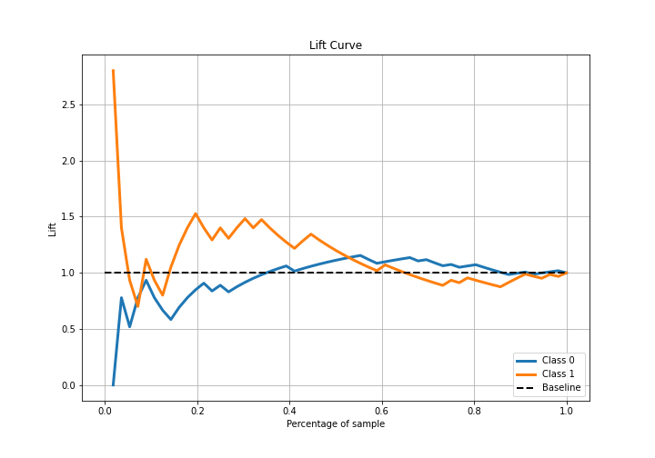

# Summary of 5_Default_NeuralNetwork

[<< Go back](../README.md)

## Neural Network
- **n_jobs**: -1
- **dense_1_size**: 32
- **dense_2_size**: 16
- **learning_rate**: 0.05
- **explain_level**: 2

## Validation
 - **validation_type**: split
 - **train_ratio**: 0.75
 - **shuffle**: True
 - **stratify**: True

## Optimized metric
logloss

## Training time

1.3 seconds

## Metric details
|           |    score |     threshold |
|:----------|---------:|--------------:|
| logloss   | 1.1347   | nan           |
| auc       | 0.543056 | nan           |
| f1        | 0.533333 |   0.404951    |
| accuracy  | 0.642857 |   0.57251     |
| precision | 0.5      |   0.57251     |
| recall    | 1        |   4.96829e-06 |
| mcc       | 0.230256 |   0.404951    |

## Metric details with threshold from accuracy metric
|           |    score |   threshold |
|:----------|---------:|------------:|
| logloss   | 1.1347   |   nan       |
| auc       | 0.543056 |   nan       |
| f1        | 0.5      |     0.57251 |
| accuracy  | 0.642857 |     0.57251 |
| precision | 0.5      |     0.57251 |
| recall    | 0.5      |     0.57251 |
| mcc       | 0.222222 |     0.57251 |

## Confusion matrix (at threshold=0.57251)
|              |   Predicted as 0 |   Predicted as 1 |
|:-------------|-----------------:|-----------------:|
| Labeled as 0 |               26 |               10 |
| Labeled as 1 |               10 |               10 |

## Learning curves

## Permutation-based Importance

## Confusion Matrix

## Normalized Confusion Matrix

## ROC Curve

## Kolmogorov-Smirnov Statistic

## Precision-Recall Curve

## Calibration Curve

## Cumulative Gains Curve

## Lift Curve

[<< Go back](../README.md)
