# Summary of 2_DecisionTree

[<< Go back](../README.md)

## Decision Tree
- **n_jobs**: -1
- **criterion**: gini
- **max_depth**: 3
- **explain_level**: 2

## Validation
 - **validation_type**: split
 - **train_ratio**: 0.75
 - **shuffle**: True
 - **stratify**: True

## Optimized metric
logloss

## Training time

5.9 seconds

## Metric details
|           |    score |   threshold |
|:----------|---------:|------------:|
| logloss   | 0.745252 | nan         |
| auc       | 0.589583 | nan         |
| f1        | 0.580645 |   0.264344  |
| accuracy  | 0.625    |   0.643939  |
| precision | 0.466667 |   0.454545  |
| recall    | 1        |   0.0321429 |
| mcc       | 0.258199 |   0.264344  |

## Metric details with threshold from accuracy metric
|           |     score |   threshold |
|:----------|----------:|------------:|
| logloss   | 0.745252  |  nan        |
| auc       | 0.589583  |  nan        |
| f1        | 0.222222  |    0.643939 |
| accuracy  | 0.625     |    0.643939 |
| precision | 0.428571  |    0.643939 |
| recall    | 0.15      |    0.643939 |
| mcc       | 0.0563436 |    0.643939 |

## Confusion matrix (at threshold=0.643939)
|              |   Predicted as 0 |   Predicted as 1 |
|:-------------|-----------------:|-----------------:|
| Labeled as 0 |               32 |                4 |
| Labeled as 1 |               17 |                3 |

## Learning curves
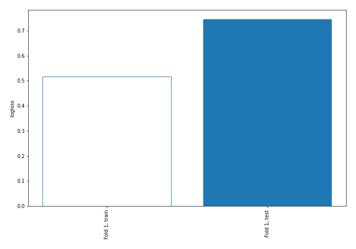

## Decision Tree 

### Tree #1
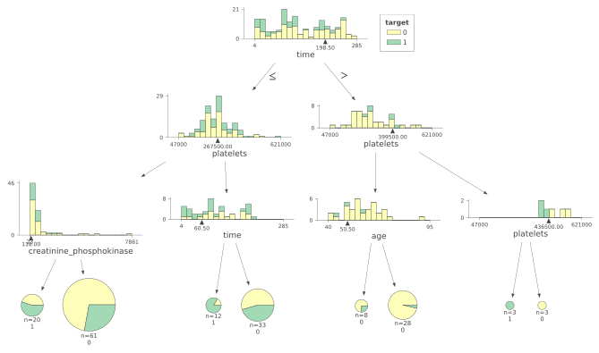

### Rules

if (time <= 198.5) and (platelets <= 267500.0) and (creatinine_phosphokinase > 118.0) then class: 0 (proba: 72.13%) | based on 61 samples

if (time <= 198.5) and (platelets > 267500.0) and (time > 60.5) then class: 0 (proba: 54.55%) | based on 33 samples

if (time > 198.5) and (platelets <= 399500.0) and (age > 50.5) then class: 0 (proba: 96.43%) | based on 28 samples

if (time <= 198.5) and (platelets <= 267500.0) and (creatinine_phosphokinase <= 118.0) then class: 1 (proba: 55.0%) | based on 20 samples

if (time <= 198.5) and (platelets > 267500.0) and (time <= 60.5) then class: 1 (proba: 83.33%) | based on 12 samples

if (time > 198.5) and (platelets <= 399500.0) and (age <= 50.5) then class: 0 (proba: 75.0%) | based on 8 samples

if (time > 198.5) and (platelets > 399500.0) and (platelets > 436500.0) then class: 0 (proba: 100.0%) | based on 3 samples

if (time > 198.5) and (platelets > 399500.0) and (platelets <= 436500.0) then class: 1 (proba: 100.0%) | based on 3 samples

## Permutation-based Importance
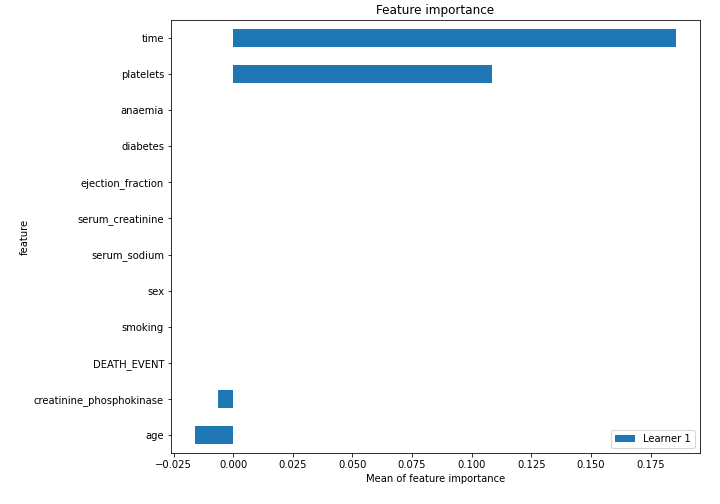
## Confusion Matrix

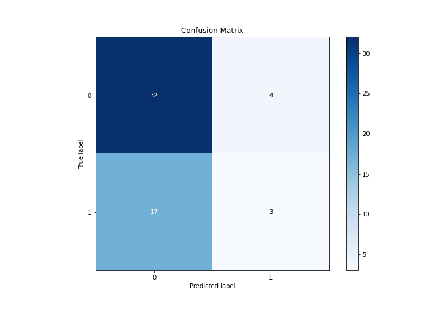

## Normalized Confusion Matrix

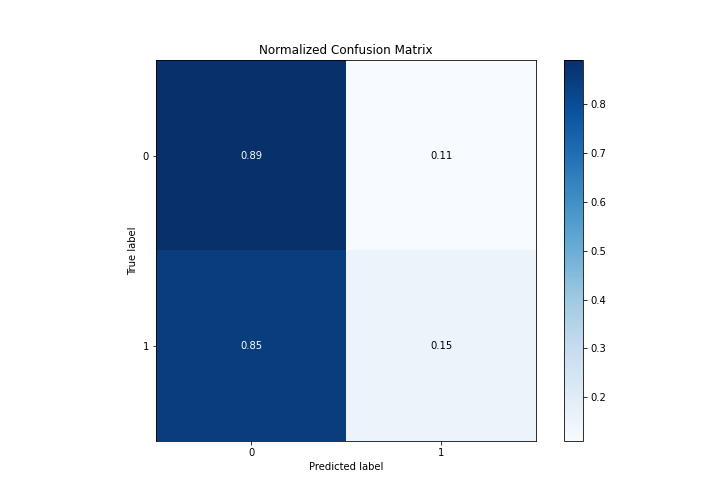

## ROC Curve

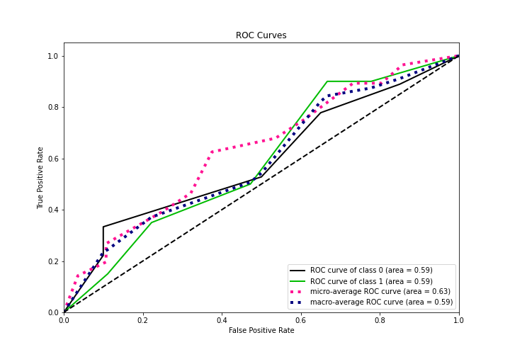

## Kolmogorov-Smirnov Statistic

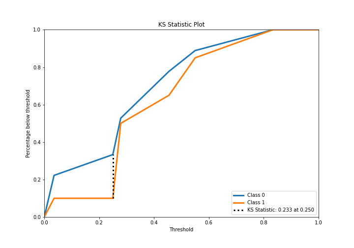

## Precision-Recall Curve

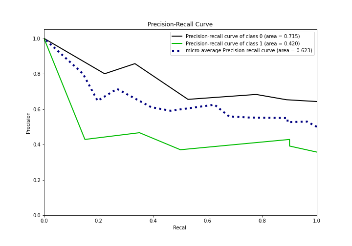

## Calibration Curve

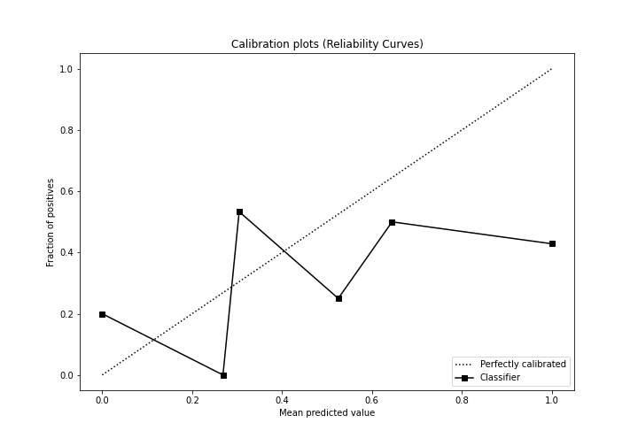

## Cumulative Gains Curve

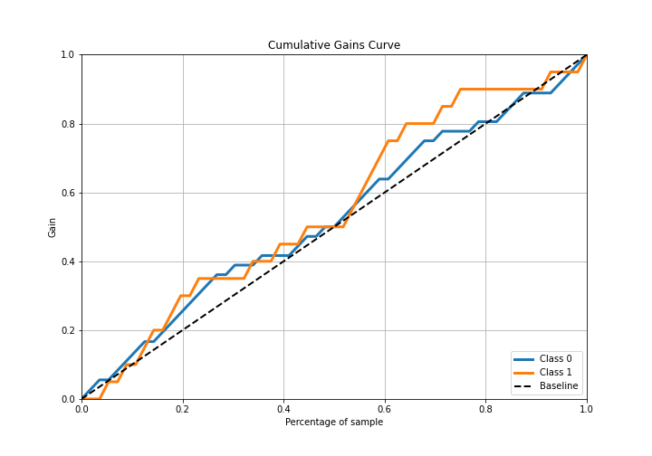

## Lift Curve

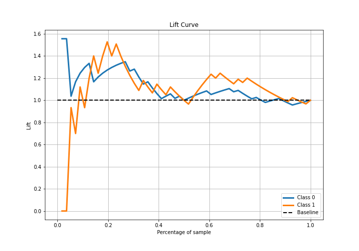

## SHAP Importance
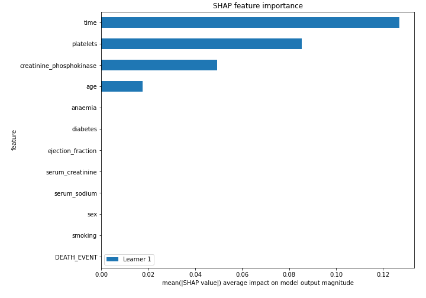

## SHAP Dependence plots

### Dependence (Fold 1)
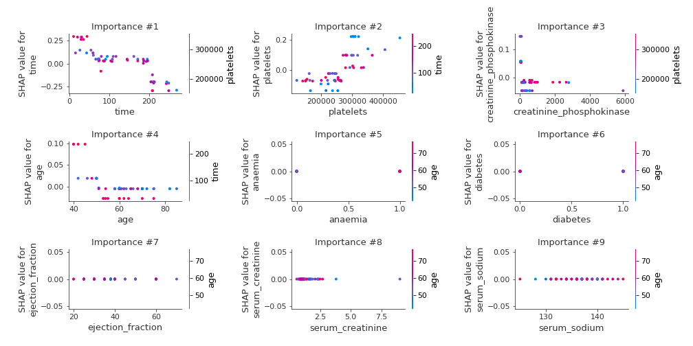

## SHAP Decision plots

### Top-10 Worst decisions for class 0 (Fold 1)

### Top-10 Best decisions for class 0 (Fold 1)
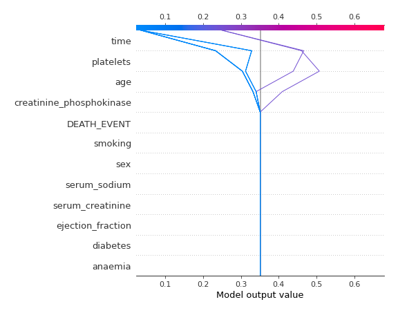
### Top-10 Worst decisions for class 1 (Fold 1)
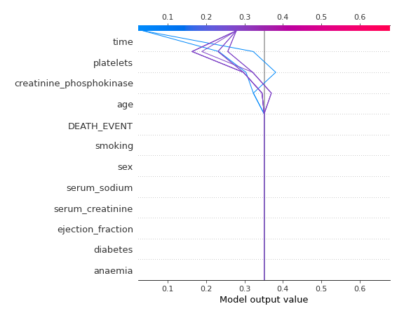
### Top-10 Best decisions for class 1 (Fold 1)
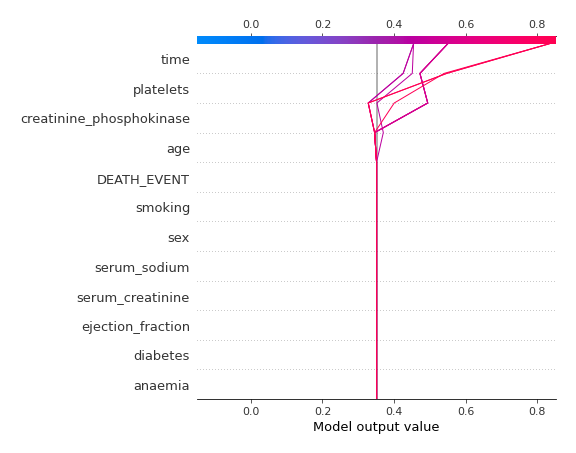

[<< Go back](../README.md)
