# Summary of 3_Linear

[<< Go back](../README.md)

## Logistic Regression (Linear)
- **n_jobs**: -1
- **explain_level**: 2

## Validation
 - **validation_type**: split
 - **train_ratio**: 0.75
 - **shuffle**: True
 - **stratify**: True

## Optimized metric
logloss

## Training time

4.2 seconds

## Metric details
|           |    score |   threshold |
|:----------|---------:|------------:|
| logloss   | 0.729557 | nan         |
| auc       | 0.527778 | nan         |
| f1        | 0.528302 |   0.326015  |
| accuracy  | 0.642857 |   0.58524   |
| precision | 0.5      |   0.58524   |
| recall    | 1        |   0.0337747 |
| mcc       | 0.167739 |   0.326015  |

## Metric details with threshold from accuracy metric
|           |    score |   threshold |
|:----------|---------:|------------:|
| logloss   | 0.729557 |   nan       |
| auc       | 0.527778 |   nan       |
| f1        | 0.285714 |     0.58524 |
| accuracy  | 0.642857 |     0.58524 |
| precision | 0.5      |     0.58524 |
| recall    | 0.2      |     0.58524 |
| mcc       | 0.121716 |     0.58524 |

## Confusion matrix (at threshold=0.58524)
|              |   Predicted as 0 |   Predicted as 1 |
|:-------------|-----------------:|-----------------:|
| Labeled as 0 |               32 |                4 |
| Labeled as 1 |               16 |                4 |

## Learning curves
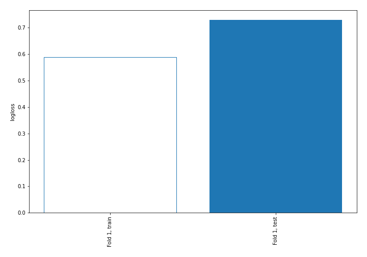

## Coefficients
| feature                  |   Learner_1 |
|:-------------------------|------------:|
| platelets                |   0.325053  |
| serum_sodium             |   0.202795  |
| diabetes                 |   0.0449569 |
| age                      |   0.0179511 |
| smoking                  |  -0.0346126 |
| sex                      |  -0.0860754 |
| anaemia                  |  -0.08686   |
| serum_creatinine         |  -0.0868632 |
| creatinine_phosphokinase |  -0.118859  |
| ejection_fraction        |  -0.208866  |
| intercept                |  -0.47464   |
| DEATH_EVENT              |  -0.562324  |
| time                     |  -0.790856  |

## Permutation-based Importance
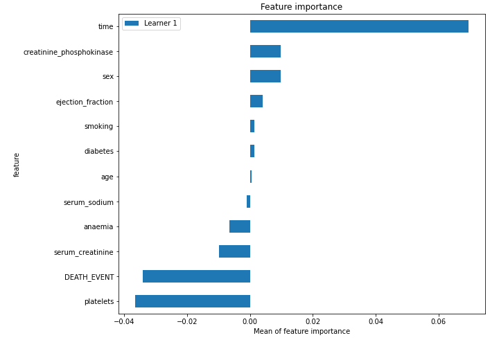
## Confusion Matrix

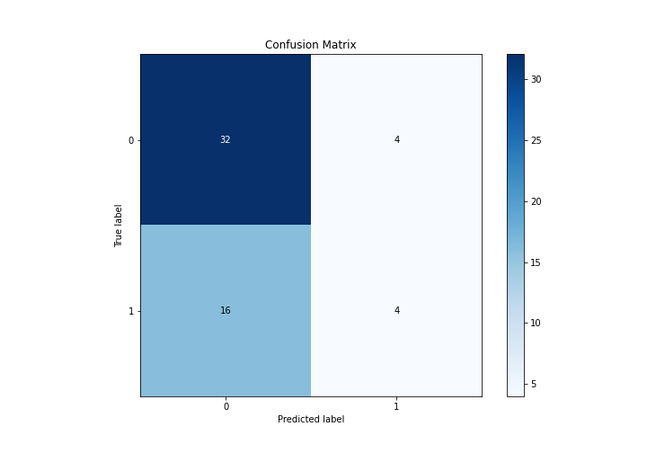

## Normalized Confusion Matrix

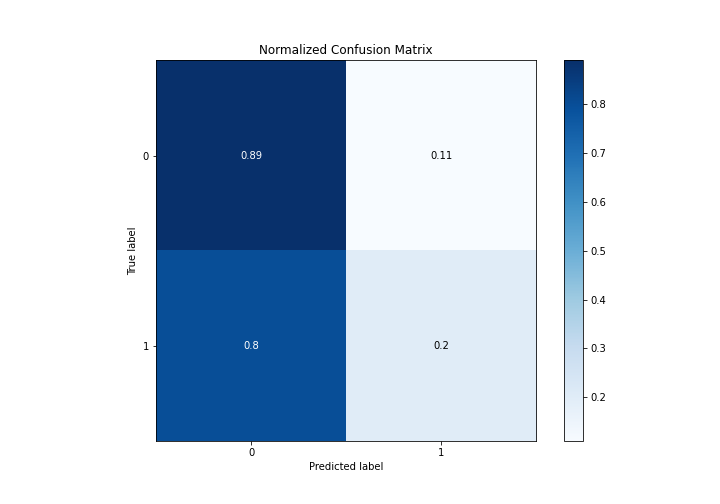

## ROC Curve

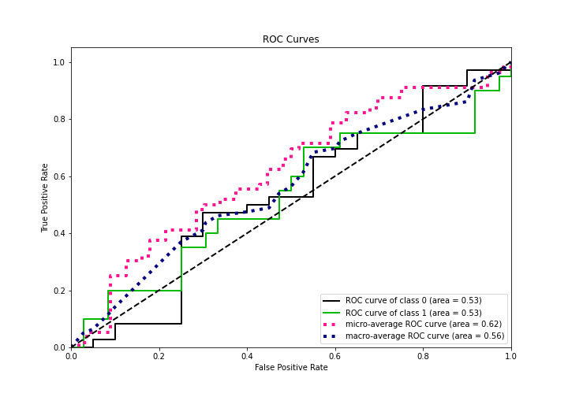

## Kolmogorov-Smirnov Statistic

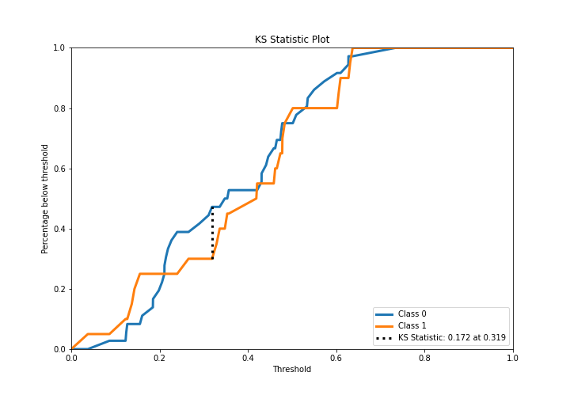

## Precision-Recall Curve

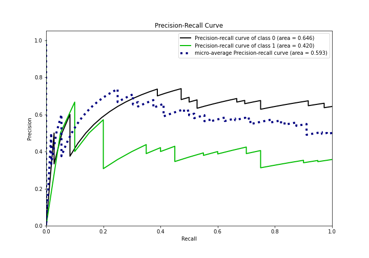

## Calibration Curve

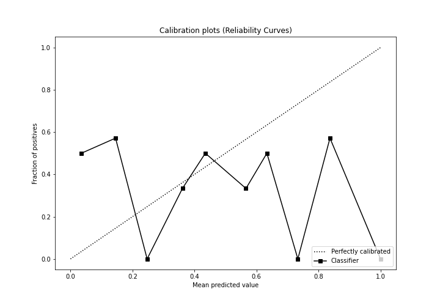

## Cumulative Gains Curve

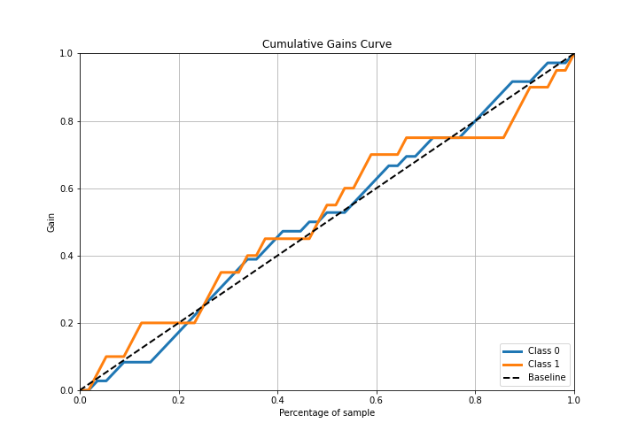

## Lift Curve

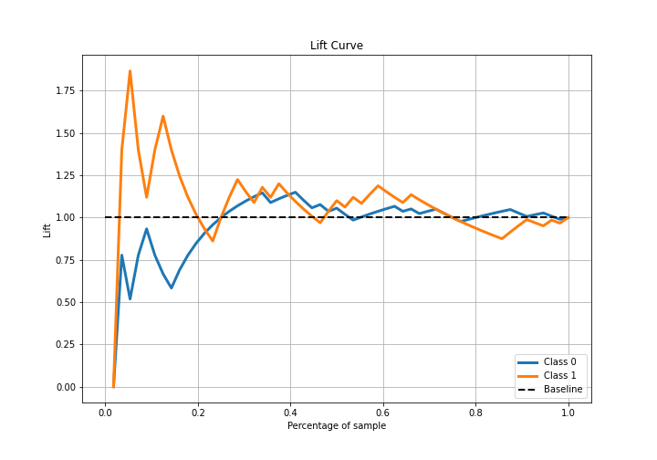

## SHAP Importance
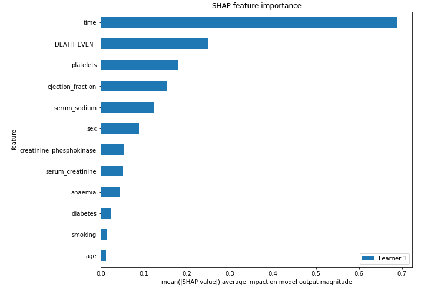

## SHAP Dependence plots

### Dependence (Fold 1)
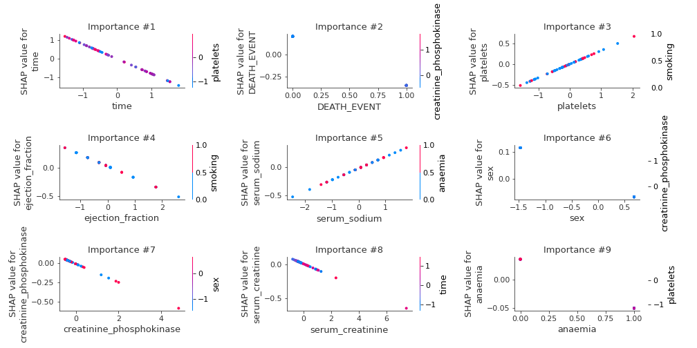

## SHAP Decision plots

### Top-10 Worst decisions for class 0 (Fold 1)
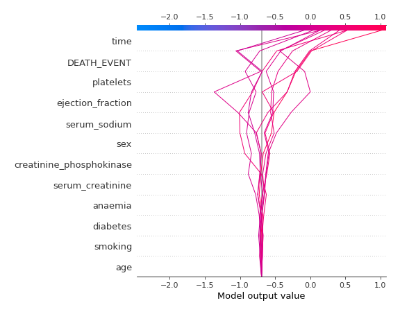
### Top-10 Best decisions for class 0 (Fold 1)
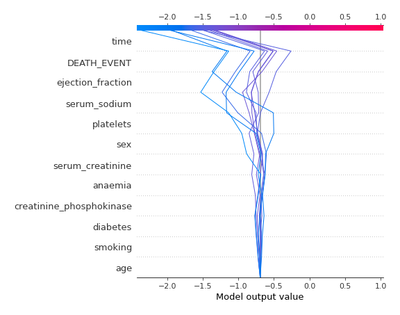
### Top-10 Worst decisions for class 1 (Fold 1)
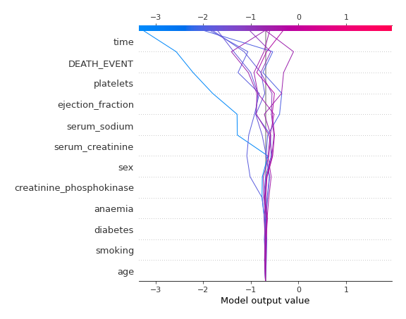
### Top-10 Best decisions for class 1 (Fold 1)
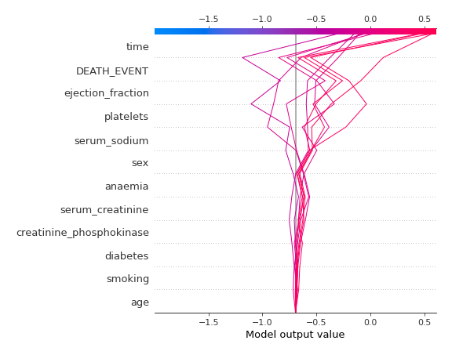

[<< Go back](../README.md)
